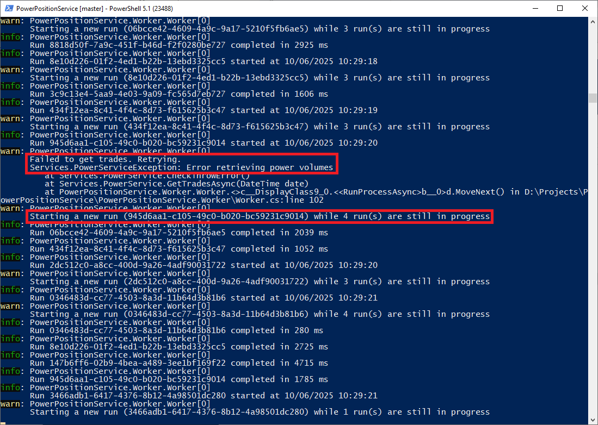

# Power Position Service

A Windows Service built with .NET 9 that periodically retrieves power trade data, aggregates hourly positions, and exports the results as CSV files.

## Tech Stack

- .NET 9 
- Worker Service template  
- xUnit for unit tests

## Design Considerations
- **Easily configurable**: Interval and output directory can be set in `appsettings.json`.
```json
"Scheduler": {
  "IntervalMinutes": 5,
  "OutputDirectory": "C:/Exports/PowerPositions"
}
```

- **Robust scheduling**: Uses `PeriodicTimer` to trigger each extraction cycle. Each cycle runs asyncronously to ensure that a cycle taking longer than the interval doesn't block the next cycle from starting so extractions are not missed. The call to the `PowerService` is retried up to 10 times to ensure that transient errors don't cause an extraction to fail.
- **Loose coupling**: Data retrieval, aggregation, and export services are represented as interfaces, allowing these to be swapped out easily for unit testing or future changes.
- **Error handling**: Exceptions during data retrieval, aggregation, or export are caught and logged without crashing the service.
- **Comprehensive logging**: Logs the start and end of each extraction cycle including the time taken, warns when cycles overlap or the call to `PowerService` needs to be retried, and logs any errors encountered.

## Stress Testing
Although the minutes interval is presumably designed to be longer than the time taken for each extraction cycle, I performed stress testing by setting the interval to 0.6 seconds. The service handled this scenario gracefully, with overlapping cycles executing without issues.

As you can see from the logs below, transient errors in the `PowerService` are retried, and logs indicate when cycles overlap, showing the number of currently running tasks.



## Future Improvements
- **Improve unit testability of Worker**: Currently, the `Worker` class is tightly coupled with `PeriodicTimer`, making it difficult to unit test. I could refactor this to allow injection of a timer interface for better testability.
- **File name uniqueness**: If required to run with sub-minute intervals, multiple cycles could run within the same minute, leading to potential file name collisions. Implementing a more robust naming strategy (e.g., including seconds or a unique identifier) would prevent overwriting files.